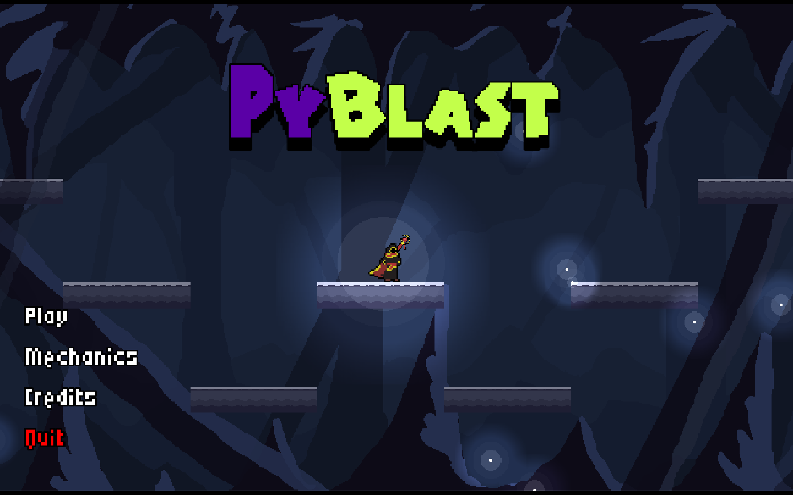
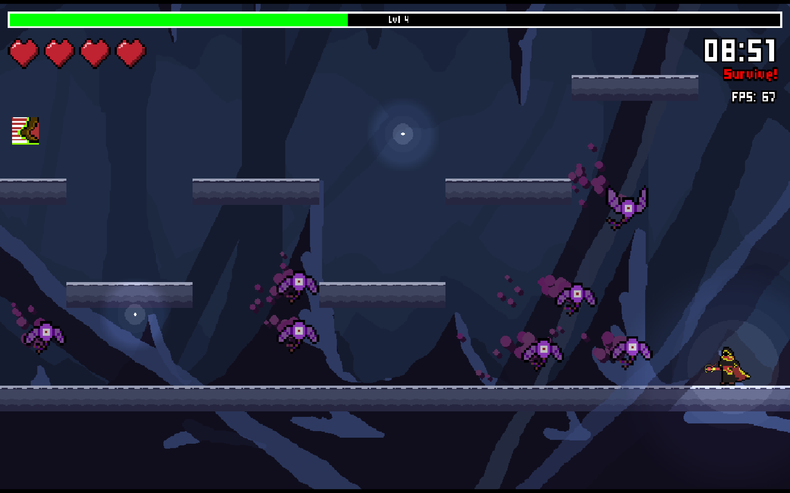
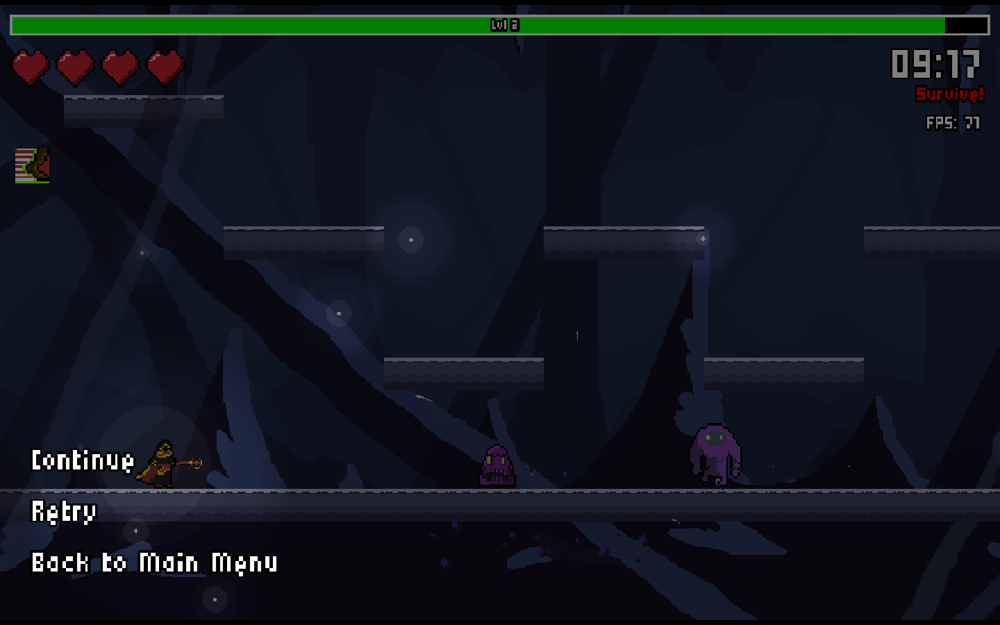
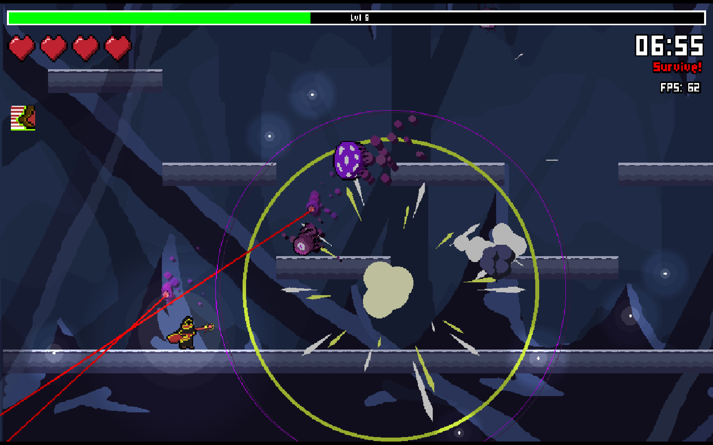
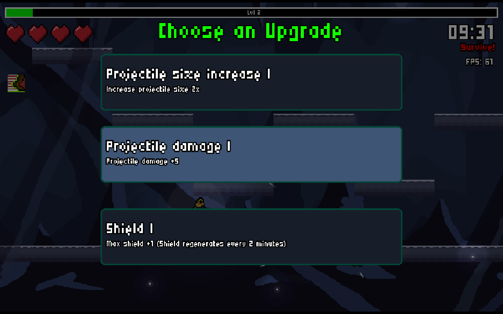
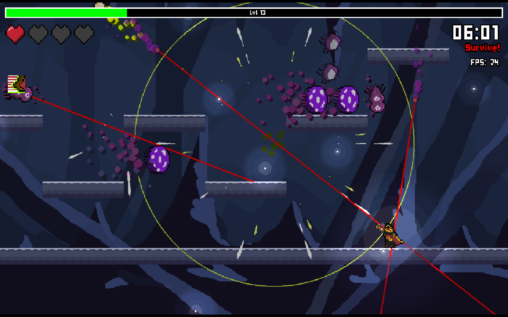
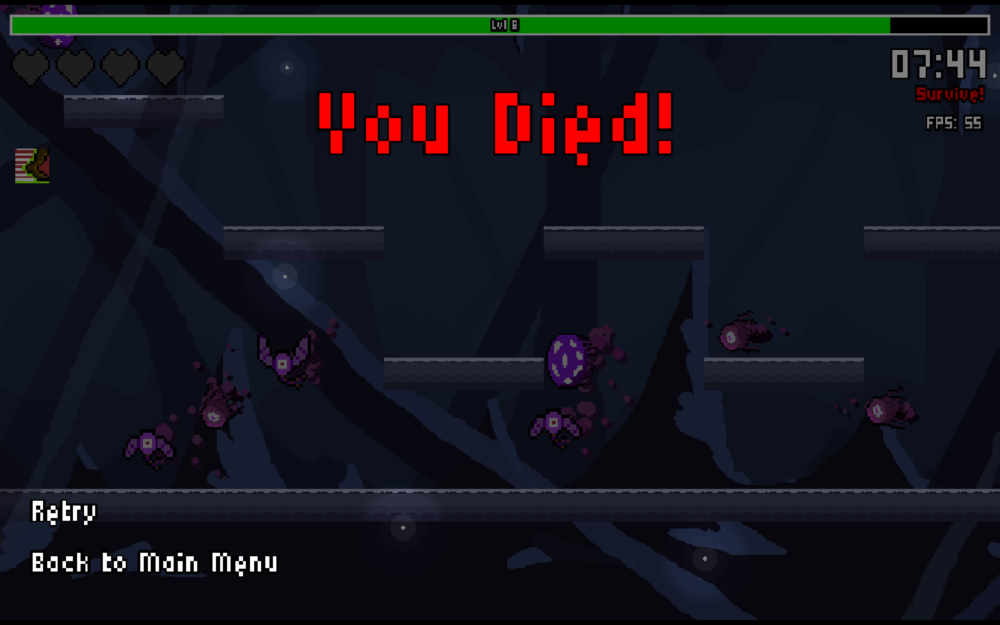

# PyBlast

PyBlast is a survival roguelike game where you defeat horde of enemies and try to survive for 10 minutes. Defeat enemies and level up to obtain upgrades that will help you last long in the cave. Equipped with dashing and slowing time, try to fight the enemies with the abilities you picked along the way.

## How to play

1. Ensure that you have `python` in your machine and `pygame-ce` instead of `pygame`. Install `pygame-ce` with `pip install pygame-ce`.

2. Clone this repository with `git clone https://github.com/Kvishh/PyBlast.git`.

3. Ensure you are in the project directory and in your terminal/command line, type `python main.py`.

